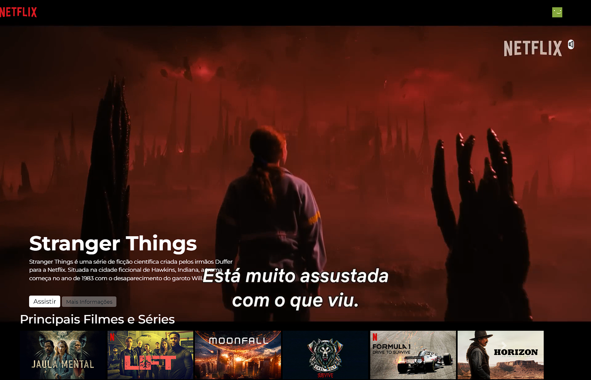

<h1>🚀 Projeto: Página da Netflix 🎬</h1>

Este foi o projeto que marcou minha entrada no mundo da programação no DevClub! Ao desenvolver essa página da Netflix, mergulhei nos fundamentos do desenvolvimento web, explorando HTML, CSS e JavaScript para criar uma interface moderna e responsiva. 
 A págia ainda falta algumas alterações e melhorias, mas já é um grande passo para o início da minha jornada como desenvolvedor.

💡 Destaques do projeto: 
✅ Estruturação semântica com HTML5 
✅ Estilização avançada com CSS3 (Flexbox & Grid) 
✅ Funcionalidades interativas com JavaScript 
✅ Design responsivo para diversos dispositivos 
Essa experiência despertou meu interesse pela área de Desenvolvimento Web, me motivando a aprofundar meus estudos e a seguir uma nova jornada profissional. 🚀

